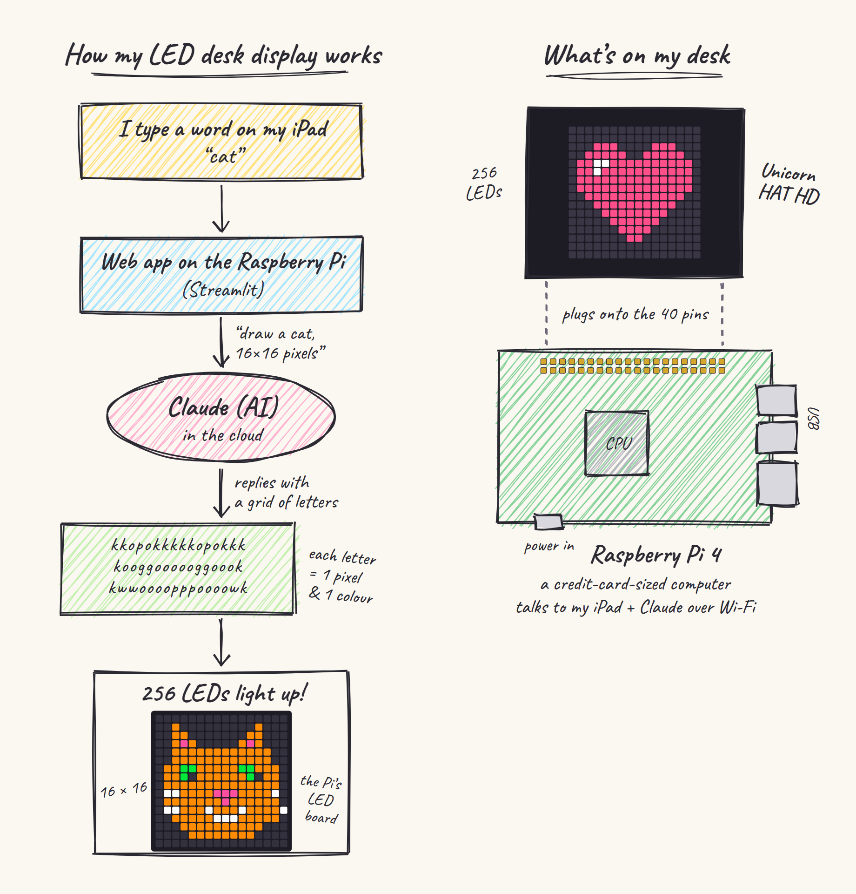
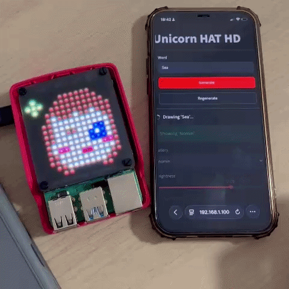

# Unicorn Desk Display

A Raspberry Pi with a 16×16 LED board that draws whatever word you type, using Claude to turn the word into pixel art.



## 1. Introduction

Type a word (say *cat*) into a small web app from your phone or iPad. The app runs on the Raspberry Pi. It asks Claude to draw the word as 16×16 pixel art. Claude answers with a grid of letters, where each letter is one pixel and stands for one colour. The Pi then lights up the 256 LEDs on the Unicorn HAT HD to match.



- Sprites are saved, so a word you've drawn before shows up straight away from the gallery.
- Sprites can have up to 4 frames, which makes simple animations like blinking or twinkling.
- After setup, the Pi starts everything on its own when you plug it in. You only need a browser.

**Hardware I used** (both from Pimoroni):
- [Raspberry Pi 4](https://shop.pimoroni.com/products/raspberry-pi-4?variant=56184185815419): the small computer that runs everything
- [Unicorn HAT HD](https://shop.pimoroni.com/products/unicorn-hat-hd): the 16×16 LED board that plugs on top

The source for the diagram is [`docs/diagram.html`](docs/diagram.html).

## 2. Raspberry Pi setup

### What you need

| Item | Notes |
|---|---|
| [Raspberry Pi 4](https://shop.pimoroni.com/products/raspberry-pi-4?variant=56184185815419) | 2 GB or more is plenty |
| [Pimoroni Unicorn HAT HD](https://shop.pimoroni.com/products/unicorn-hat-hd) | 16×16 RGB LEDs, sits on the Pi's 40 pins |
| microSD card | 16 GB or more |
| Official USB-C power supply | Weak supplies cause odd LED behaviour |
| Anthropic API key | From [console.anthropic.com](https://console.anthropic.com). A Claude Pro/Max subscription does not include API access. |

### Flash the SD card

1. Install [Raspberry Pi Imager](https://www.raspberrypi.com/software/) on your computer.
2. Choose **Raspberry Pi 4** → **Raspberry Pi OS Lite (64-bit)** → your SD card.
3. When it asks about settings, choose **Edit settings** and set:
   - hostname: `unicorn`
   - a username and password
   - your Wi-Fi name, password and **country**
   - **Services → Enable SSH** (password login)
4. Write the card and put it in the Pi.

### First boot

1. With the Pi **unplugged**, press the HAT firmly onto all 40 pins.
2. Plug in the power and wait 2–3 minutes.
3. From your computer, connect over SSH. If `unicorn.local` doesn't resolve, use the Pi's IP address from your router.
   ```bash
   ssh <user>@unicorn.local
   ```
4. Turn on SPI, which the HAT needs, then update and reboot:
   ```bash
   sudo raspi-config nonint do_spi 0
   sudo apt update && sudo apt full-upgrade -y
   sudo apt install -y git python3-venv python3-dev python3-pil python3-numpy
   sudo reboot
   ```
5. After the reboot, check that `ls /dev/spidev*` lists `spidev0.0`.

### Install the project

Raspberry Pi OS won't install pip packages system-wide, so the project uses its own Python environment:

```bash
python3 -m venv --system-site-packages ~/unicorn-env
source ~/unicorn-env/bin/activate

git clone https://github.com/nominmar/unicorn_hat.git ~/unicorn
cd ~/unicorn
pip install -r requirements.txt unicornhathd
```

The repo is private, so `git clone` asks for a password. GitHub doesn't accept account passwords here; use a **fine-grained personal access token** instead:
1. Go to GitHub → Settings → Developer settings → Personal access tokens.
2. Limit it to this one repository.
3. Under **Repository permissions**, set **Contents** to **Read-only**. Without this, cloning fails with a confusing "Write access not granted" error.

To save the token so `git pull` doesn't ask again:
```bash
git config --global credential.helper store
```

### Try it by hand

```bash
export ANTHROPIC_API_KEY=sk-ant-...
python llm.py cat          # draws a cat and prints it as text
python display.py          # waits silently for state.json
```

In a second SSH session:
```bash
cd ~/unicorn
echo '{"sprite": "art/cat.json", "brightness": 0.3}' > state.json
```

The cat should appear on the LEDs.
- **Upside down:** change `ROTATION` in `display.py`.
- **Washed out:** adjust `GAMMA`.

### Run on boot

The `deploy/` folder has two systemd services: one for the display and one for the web app. They assume the user is `nmargade`, the code is in `~/unicorn` and the environment is in `~/unicorn-env`. Edit the paths if yours differ.

```bash
sudo nano /etc/unicorn.env     # one line: ANTHROPIC_API_KEY=sk-ant-...   (no "export", no quotes)
sudo chmod 600 /etc/unicorn.env

sudo cp deploy/*.service /etc/systemd/system/
sudo systemctl daemon-reload
sudo systemctl enable --now unicorn-display unicorn-ui
systemctl status unicorn-display unicorn-ui
```

Now open `http://unicorn.local:8501` (or `http://<pi-ip>:8501`) on a phone or iPad on the same Wi-Fi. In Safari, **Share → Add to Home Screen** makes it open like an app.

Useful commands:
- **Logs:** `journalctl -u unicorn-ui -f` or `journalctl -u unicorn-display -f`
- **After `git pull`:** `sudo systemctl restart unicorn-display unicorn-ui`

### Turning it off

Don't just pull the plug while the Pi is running, because it can corrupt the SD card. Either:
- in the app, open **Power → Shut down Pi**, or
- over SSH, run `sudo shutdown now`.

Then wait for the green light to stop flickering, and unplug. The HAT may stay lit until you unplug; that's normal. When you plug it back in, the last sprite comes back on its own.

The app has no login, so keep it on your home network. To reach it from outside, use something like Tailscale rather than opening a port on your router.

## 3. Code

### How it fits together

Two programs run on the Pi. They talk only through files:

```
browser ──► app.py (Streamlit) ──► llm.py ──► Claude API
                 │                    │
                 │ writes             │ saves
                 ▼                    ▼
            state.json  ──────►  art/<word>.json
                 │
                 ▼ watched by
            display.py ──► unicornhathd ──► LEDs
```

Only `display.py` touches the LEDs. Streamlit reruns its script on every click, so drawing from it directly would make the display stutter.

### Files

| File | What it does |
|---|---|
| `sprites.py` | Sprite format: validation, auto-repair of small model mistakes, file naming, safe file writes, preview images, LED colour correction and drawing |
| `llm.py` | Word → Claude → sprite. Caches results in `art/`, retries once, and holds the `CUSTOM` prompts for special words |
| `display.py` | Watches `state.json` and draws or animates the chosen sprite. Turns the LEDs off on exit |
| `app.py` | Web app: generate, gallery, brightness, on/off, preview, shutdown |
| `deploy/*.service` | systemd units to start both programs on boot |
| `docs/` | The diagram above, as HTML and PNG |
| `unicorn-plan.md` | The full project plan, including later phases |
| `PROGRESS.md` | Where the work is up to |

### Sprite format (`art/<word>.json`)

```json
{
  "name": "cat",
  "palette": {"k": [0, 0, 0], "o": [255, 140, 0], "g": [0, 255, 60]},
  "fps": 2,
  "frames": [
    ["kkkkkkkkkkkkkkkk", "... 16 rows of 16 characters ..."]
  ]
}
```

- **Palette:** up to 8 colours. Each key is one character, and `k` is always black (the background).
- **Frames:** 1–4. One frame is a still image; more frames loop at `fps`.

### Display state (`state.json`)

```json
{"sprite": "art/cat.json", "brightness": 0.5}
```

`"sprite": null` turns the LEDs off. The app writes this file, and `display.py` checks it 10 times a second. Files are written to a temporary file and then renamed, so the display never reads a half-written file.

### How a word becomes a sprite

1. `app.py` calls `llm.generate(word)`.
2. If `art/<slug>.json` already exists, it's returned straight away. **Regenerate** skips this cache.
3. Otherwise Claude is called with a system prompt describing the format and style, plus a strict JSON schema, so the reply is always well-formed JSON. Strict schemas can't express "any single-character key", so the palette comes back as a list and is converted to a dict afterwards.
4. `sprites.repair()` fixes small slips: rows one or two characters too long or short, unknown characters, a missing or non-black `k`. Anything worse raises an error, and the call is retried once with the error message included.
5. The sprite is saved and written to `state.json`, so it appears on the LEDs immediately.

### Settings worth changing

| Where | Setting | Default | Effect |
|---|---|---|---|
| `llm.py` | `MODEL` | `claude-opus-5-5` | Which Claude model draws |
| `llm.py` | `EFFORT` | `low` | Higher is slower but usually better art |
| `llm.py` | `CUSTOM` | `{"nomin": ...}` | Words that get a hand-written description instead |
| `display.py` | `ROTATION` | `0` | 0 / 90 / 180 / 270 to match how the Pi sits |
| `display.py` | `GAMMA` | `2.0` | LED colour correction; try 1.8–2.2 |

### Running on a PC

`app.py` and `llm.py` work on any computer, which is handy for trying prompts:

```bash
pip install -r requirements.txt
streamlit run app.py
```

`display.py` needs the HAT, so it only runs on the Pi.

### What's next

Market moods (stock rules and a yield curve), built-in sprites and a clock mode. See [`unicorn-plan.md`](unicorn-plan.md) and [`PROGRESS.md`](PROGRESS.md).
